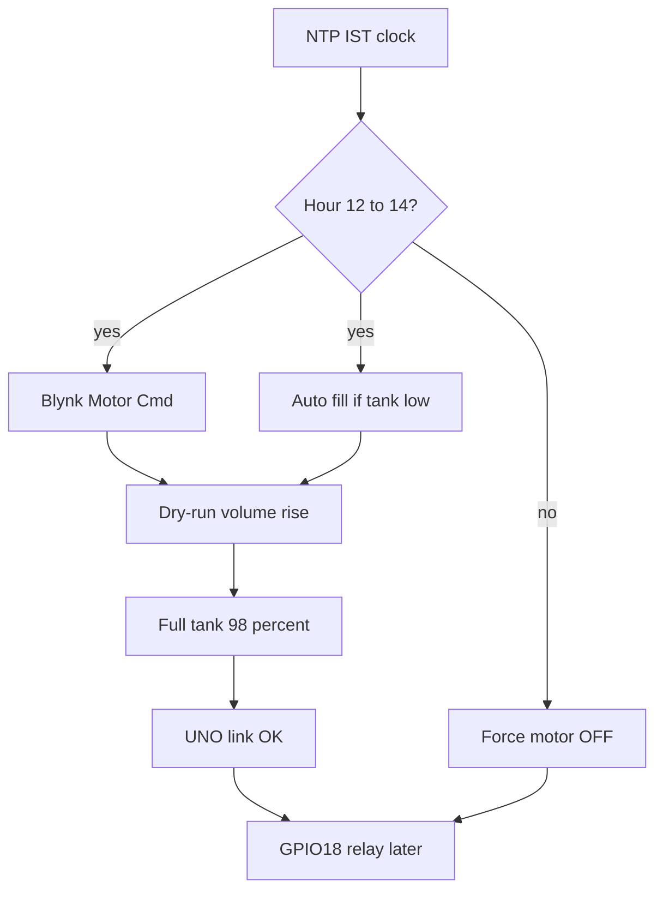

# Next features: time, pump, dry-run, OTA, remote logs

Today the ESP32 is **monitor-only**: Modbus distance → tank %, Blynk MQTT, low/full alarms. There is **no NTP, no relay GPIO, no OTA partition, no remote log path**. Blynk already subscribes to `downlink/#` but only handles `downlink/redirect` ([main/blynk.c](main/blynk.c)).

You chose: **Blynk ON/OFF now, wire the relay later**, and **auto-fill in 12:00–14:00 IST plus a Blynk override that still respects that window**.

Work in **five sequential phases**. Each phase is flashable on its own. Do **not** reflash the Arduino unless we later need a Modbus coil.

---

## Phase 1 — IST time

New module `main/time_sync.c` after Wi-Fi is up:

- SNTP (`pool.ntp.org` / `time.google.com`)
- Timezone `IST-5:30` (POSIX for UTC+5:30)
- `time_ist_ready()` is true only after a successful sync
- Log `IST 13:04:22` on each 30 s Blynk heartbeat

Until time is valid: **no auto-fill and no Blynk ON** (window cannot be trusted). Motor stays OFF.

Optional Blynk string later: “Last NTP sync”. Not required for v1.

---

## Phase 2 — Pump control (software first)

**GPIO:** `MOTOR_RELAY_GPIO 18`, active-HIGH, default **OFF at boot** (fail-safe). Document the later wiring: ESP GPIO 18 → transistor/optocoupler → 5 V relay → starter/contactor. No hardware change in this phase; the pin just sits low.

**Blynk (new datastreams):**

- **V8 Motor Cmd** — writable integer 0/1 (app switch)
- **V9 Motor State** — readonly 0/1 (actual GPIO)
- Keep V7 for alarms; add **V7 = 3** for dry-run (phase 3)

Handle MQTT `downlink/ds` / `downlink/ds/Motor Cmd` in [main/blynk.c](main/blynk.c) so a widget write actually reaches firmware.

**Window:** motor may be ON only when IST hour is **≥ 12 and &lt; 14**. At 14:00:00 force OFF. **OFF is always allowed** (safety). ON outside the window is ignored and logged.

**Auto-fill (defaults, compile-time for v1):**

- Start if in window, time valid, tank **&lt; 40%**, UNO OK, not dry-run latched, not already ON
- Stop if **≥ 98%** (reuse existing full-tank hysteresis) or window ends

Manual Blynk ON in-window still works even if level is above 40% (override), but still stops at 98% / dry-run / 14:00.

Publish V8/V9 on the existing 30 s MQTT batch, plus immediately when state changes (same pattern as alarms).

---

## Phase 3 — Dry-run from tank rise

Inlet **11 L/min** → ~10.5 mm/min on the 950 mm / 1000 L usable column.

Logic (only while motor is ON and level is not already near full, e.g. &lt; 90%):

1. Ignore the first **30 s** (pipe fill / splash)
2. Then watch **3 minutes** of valid readings
3. Require volume rise **≥ 12 L** (~40% of expected 33 L) **or** water rise **≥ 12 mm**
4. If UNO is lost or readings are invalid during a run → **stop immediately** (unsafe)

On fail: force OFF, latch `dry_run_blocked`, V7 = 3, MQTT/HTTP event `dry_run`. Do **not** auto-start again until Blynk sends Motor Cmd 0 then 1 (manual clear) or a later reset datastream.

Noise: HC-SR04 can jump several mm; 3 min / 12 L is conservative vs a 1-minute check.

---

## Phase 4 — OTA (ESP32 only)

Current tree uses **single-app** partitions; local `sdkconfig` has been **2 MB flash**. The MQTT binary was already tight on a 1 MB factory slot. Dual OTA needs:

1. Confirm chip flash with `esptool.py flash_id` (DevKit WROOM is usually **4 MB**; 2 MB cannot hold two copies)
2. Custom [partitions.csv](partitions.csv): `nvs`, `otadata`, `ota_0`, `ota_1` (~1.5 MB each on 4 MB)
3. `sdkconfig.defaults`: 4 MB flash, custom table, `CONFIG_BOOTLOADER_APP_ROLLBACK_ENABLE`

**Mechanism:** ESP-IDF `esp_https_ota` from a URL (GitHub release or a file on your PC via HTTP). Trigger with a Blynk button (e.g. V12) after writing the URL once, or a compile-time default URL. After boot, call `esp_ota_mark_app_valid_cancel_rollback()` only if Wi-Fi + Modbus come up.

Rooftop **Arduino stays USB-only** — no wireless UNO upgrade.

If the image is still too large for 1.5 MB: drop unused IDF components before adding OTA, don’t shrink monitoring features.

---

## Phase 5 — Remote terminal (no USB)

USB CDC is the only log path today. For field debug:

- Hook `esp_log_set_vprintf` into a **ring buffer** (~8–16 KB)
- TCP server on **port 2323** (LAN): `nc 192.168.x.x 2323` dumps live logs
- Print the IP once after Wi-Fi connect
- Optional: Blynk Terminal command `log` sends the **last ~20 lines only** so it does not burn the 100k message quota

Do not stream every log line to Blynk MQTT.

---

## Extra improvisations (recommended order)

**Do with the pump work (safety):**

- Motor **OFF on boot**, UNO lost, sensor fault, full tank, window end, dry-run
- Never ON if time is unsynced
- Persist dry-run latch in NVS so a reboot cannot immediately retry a dry well
- Log a one-line **fill session**: start %, end %, litres, minutes

**Soon after:**

- Time-to-full estimate at 11 L/min on the dashboard
- Firmware version / OTA slot on Blynk (debug)
- Align Arduino 1500 mm placeholder with ESP 1300/1100/150 model ([Arduino_Tank_Node](Arduino_Tank_Node/src/main.cpp) vs [main/tank.h](main/tank.h))
- Move Wi-Fi SSID out of [main/wifi.c](main/wifi.c) into NVS/`secrets.h`

**Later hardware:**

- Waterproof **JSN-SR04T** on the UNO (README intent)
- Current-transformer dry-run as a second check (level-based is v1)
- Watchdog timer so a hung MQTT task cannot leave the motor ON

---

## Blynk console work (you)

| Pin | Name | Role |
|-----|------|------|
| V8 | Motor Cmd | Switch 0/1 |
| V9 | Motor State | LED/value 0/1 |
| V7 | Alarm | Add 3 = dry run |
| — | `dry_run` event | Notifications on |

Keep fill/low events on V7 = 1 / 2 as they are.

---

## Out of scope for this pass

- Wiring or choosing the contactor
- Arduino OTA
- Changing 12:00–14:00 or 11 L/min without you asking
- Reflashing the UNO
